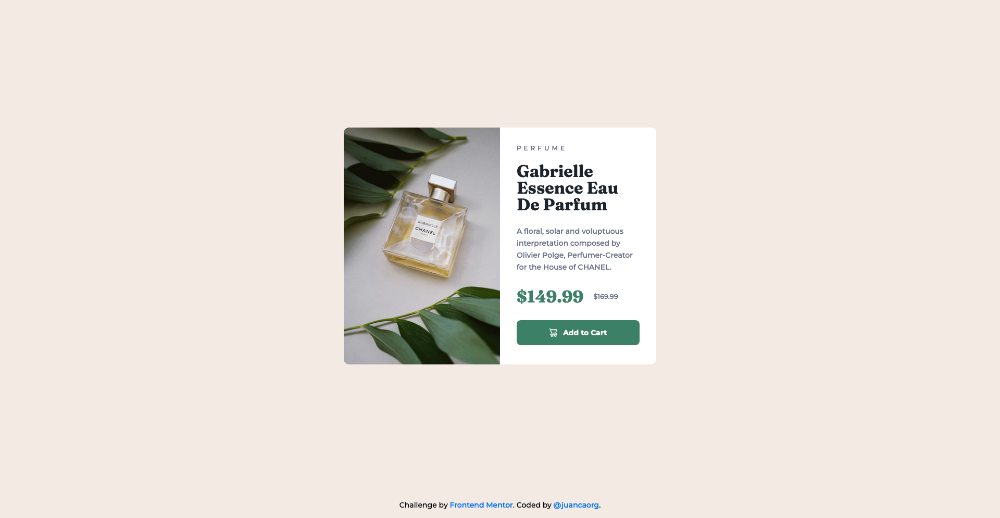

# Frontend Mentor - Product Preview Card Component

This is a solution to the [Product preview card component challenge on Frontend Mentor](https://www.frontendmentor.io/challenges/product-preview-card-component-GO7UmttRfa). Frontend Mentor challenges help you improve your coding skills by building realistic projects. 

## Table of contents

- [Overview](#overview)
  - [Screenshot](#screenshot)
  - [Links](#links)
- [Built with](#built-with)
- [Author](#author)

## Overview

### Screenshot

### Links

- Solution URL: [GitHub Repository](https://github.com/juancaorg/product-preview-card)
- Live Site URL: [productpreviewcard.juanca.dev](https://productpreviewcard.juanca.dev)

## My process

### Built with

- HTML5 
- CSS custom properties
- CSS Flex
- CSS Grid
- Media queries

### What I learned

Building by using the "mobile first" approach isn't as intimidating as I thought. Just keep in mind when to use min-width or max-width.

A great article on that: [Media Queries in CSS – Min-Width and Max-Width](https://coderjony.com/blogs/media-queries-in-css-min-width-and-max-width/).

**TL;DR**. If you are going **mobile-first** you are going to be using a lot of **min-width**.

Otherwise, if you are going **desktop-first** you are going to be using a lot of **max-width**. 

## Author

- Website - [juanca.org](https://www.juanca.org)
- Frontend Mentor - [@juancaorg](https://www.frontendmentor.io/profile/juancaorg)
- Twitter - [@juancaorg](https://twitter.com/juancaorg)
